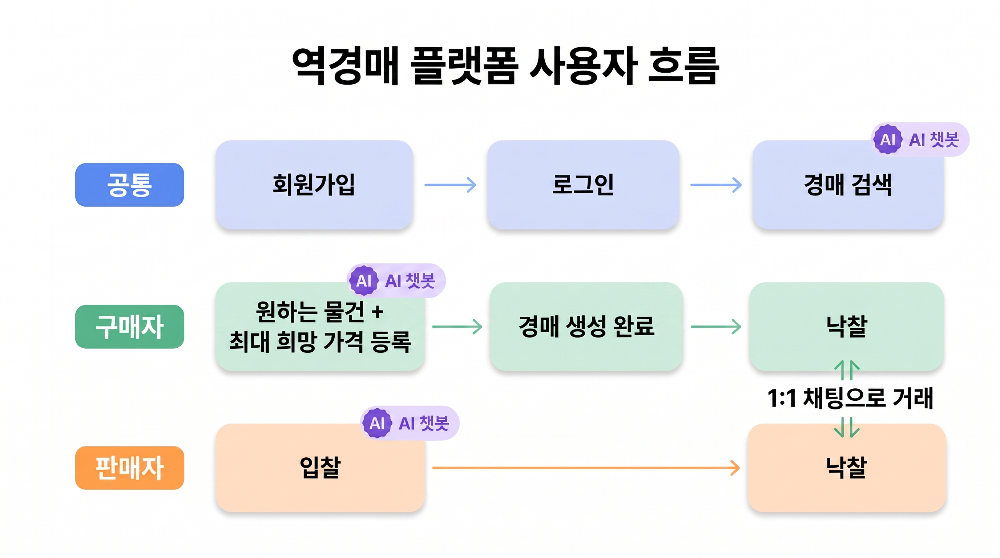
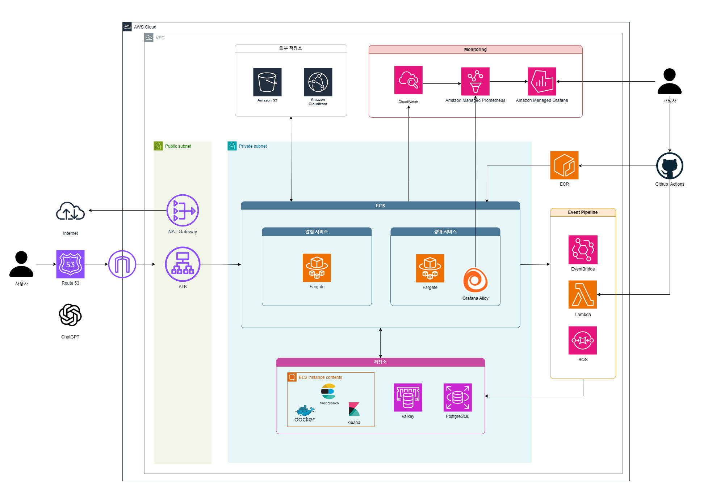
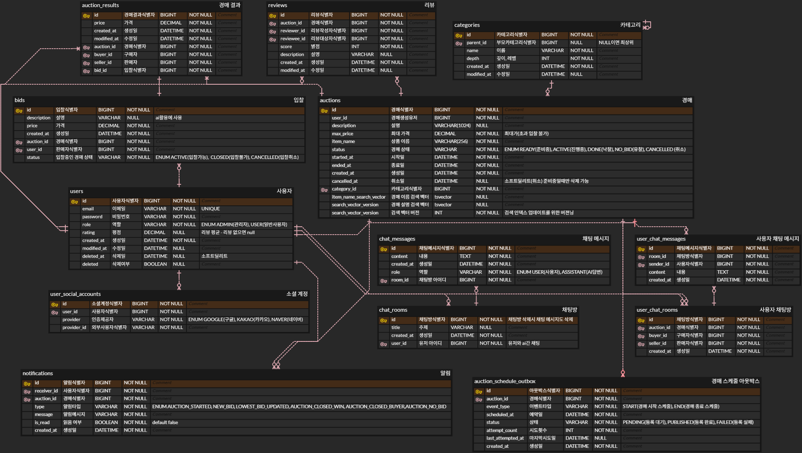

# 실시간 역경매 서비스


> 구매자가 원하는 물품을 등록하면, 판매자들이 경쟁적으로 가격을 낮춰 입찰하는 **역경매(Reverse Auction)** 서비스입니다.

```
구매자  →  경매 등록 (최대 희망가 설정)
판매자  →  입찰 (더 낮은 가격 경쟁)
마감    →  최저가 판매자 자동 낙찰
```

---

## 1. 팀원 소개

<div align="center">
  <table>
    <tbody>
      <tr>
        <td align="center" valign="top" width="25%">
          <a href="https://github.com/hhjo96"></a><br /><br />
          <b>팀장</b><br />
          <a href="https://github.com/hhjo96">조현희</a><br />
          <sub>──────────</sub><br />
          입찰<br />부하테스트<br />경매 상태 자동화<br />Outbox 패턴 적용
        </td>
        <td align="center" valign="top" width="25%">
          <a href="https://github.com/minky5004"></a><br /><br />
          <b>팀원</b><br />
          <a href="https://github.com/minky5004">윤민기</a><br />
          <sub>──────────</sub><br />
          AI 상담 챗봇<br />모니터링<br />리뷰 이미지<br />기타 인프라
        </td>
        <td align="center" valign="top" width="25%">
          <a href="https://github.com/imprity"></a><br /><br />
          <b>팀원</b><br />
          <a href="https://github.com/imprity">조성진</a><br />
          <sub>──────────</sub><br />
          CI/CD<br />경매 검색 <br /> 경매 조회 <br /> 메인 인프라 
        </td>
        <td align="center" valign="top" width="25%">
          <a href="https://github.com/soomin0209"></a><br /><br />
          <b>팀원</b><br />
          <a href="https://github.com/soomin0209">김수민</a><br />
          <sub>──────────</sub><br />
          인증/인가<br />카테고리<br />리뷰<br />실시간 알림<br />실시간 채팅<br />가상스레드 적용
        </td>
      </tr>
    </tbody>
  </table>
</div>


---

## 2. 프로젝트 개요

**개발 기간**: 2026.04.07 ~ 2026.05.14

### 핵심 차별점 — AI 상담 챗봇

별도 AI 채팅방에서 **GPT-4o** 기반 AI가 실시간 시세, 판매자 신뢰도, 경쟁 입찰 현황 등을 분석해드립니다.
DB의 실제 거래 데이터를 **Tool Calling + RAG**로 실시간 조회하므로 hallucination 없이 플랫폼 데이터를 정확하게 안내합니다.



---

## 3. 기술 스택

<div align="center">

### **Language**
 

### **Backend**
    

### **Security**
 

### **Real-time**
 

### **Database**
    

### **Message Queue**
 

### **AI Model**


### **Infra / Cloud**
           

### **CI/CD**
 

### **Monitoring**
    

### **Test**
    

### **Open API**
  

### **Collaboration**
     

</div>

---

## 4. 아키텍처



---

## 5. ERD



---

## 6. API 명세서

[API명세서 링크](https://www.notion.so/API-35df7cf0a20c80b885a0dd708f506cbb?showMoveTo=true&saveParent=true)

---

## 7. 주요 기능

### 1. 회원 인증
- JWT 기반 Stateless 인증 (Access 30분 / Refresh 7일)
- 소셜 로그인: Google, Kakao, Naver OAuth2
- 로그인 5회 실패 시 5분 계정 잠금, Refresh Token 탈취 시 즉시 무효화

### 2. 경매
- EventBridge Scheduler로 시작/종료 스케줄 자동 등록, Lambda가 낙찰/유찰 자동 처리
- Elasticsearch + PostgreSQL 이중 검색 (Nori 한국어 형태소 분석)

### 3. 입찰
- Redisson 분산락으로 동시 입찰 경합 방지
- 현재 최저가보다 낮은 가격만 등록 가능, 입찰 시 실시간 알림 자동 발행

### 4. 실시간 알림
- Lambda → Redis Pub/Sub → 알림 서버 → SSE로 클라이언트에 실시간 전달
- 알림은 PostgreSQL에 저장되어 재접속 시에도 누락 없이 조회 가능

### 5. 유저간 실시간 채팅
- 낙찰 후 구매자-판매자 1:1 채팅방 자동 생성
- WebSocket + STOMP + SockJS, Redis Pub/Sub으로 다중 서버 인스턴스 간 메시지 공유

### 6. 리뷰
- 낙찰 경매 당사자(구매자/판매자)만 작성 가능, 별점 필수
- S3 Presigned URL로 이미지 업로드, 리뷰 저장 시 pgvector 임베딩 자동 연동

### 7. AI 상담 챗봇

SSE 스트리밍으로 실시간 응답을 수신하며, Tool Calling과 RAG를 통해 DB의 실제 데이터를 기반으로 답변합니다.

| Tool | 역할 |
|------|------|
| `getBidsByAuctionId` | 경매 입찰 현황 · 최저가 · 경쟁 분석 |
| `getRecentAuctionResults` | 상품 시세 · 낙찰 이력 조회 |
| `getSellerStats` | 판매자 종합 신뢰도 (낙찰 횟수, 평균 평점) |
| `getSellerReviewInsights` | 판매자 후기 키워드 분석 (RAG) |
| `getMyAuctions` | 내가 등록한 경매 현황 · 현재 최저가 |
| `getMyBids` | 내가 입찰한 경매 현황 · 1위 여부 |
| `getAuctionStatsByCategory` | 카테고리별 낙찰 통계 · 시세 분석 |
| `searchAuctionDescriptions` | 낙찰 경매 상품 설명 의미 검색 (RAG) |

### 8. CI/CD

GitHub Actions 기반으로 CI는 push/PR 시 자동 빌드 및 테스트, CD는 수동 트리거(커밋 해시 입력)로 ECR push → ECS 무중단 배포까지 진행합니다. Lambda는 push 시 자동 배포되며, AWS 인증은 OIDC(키 없이 역할 기반)로 처리합니다.

---
## 8. 트러블 슈팅 / 성능 개선 / 기술적 의사결정


### 1. 경매 시작/종료 시간 지연 개선

#### 문제 원인

- 경매 시작/종료 스케줄링을 EventBridge → Lambda 직접 호출 방식으로 구현했을 때, 이벤트브릿지 자체 지연으로 인해 최대 1분의 지연이 발생함
- 경매 시작/종료에 따른 경매 상태의 정확성이 보장되지 않음

#### 기술 도입

- SQS 지연 큐를 도입하여 EventBridge가 목표 시각 **5분 전**에 트리거되어 SQS 메시지에 딜레이를 동적으로 계산해서 설정

#### SQS 적용 후 테스트 결과

|  | 경매 A | 경매 B | 경매 C |
|--|--------|--------|--------|
| 목표 시작 | 13:36:30 | 15:16:30 | 16:10:30 |
| 목표 종료 | 13:43:30 | 15:20:30 | 16:13:30 |
| 적용 후 시작 | 13:36:30.446 (+0.446초) | 15:16:30.385 (+0.385초) | 16:10:30.612 (+0.612초) |
| 적용 후 종료 | 13:43:30.330 (+0.330초) | 15:20:30.420 (+0.420초) | 16:13:30.365 (+0.371초) |
| 적용 전 시작 | 13:36:36 (+6초) | 15:17:08 (+38초) | 16:11:08 (+38초) |
| 적용 전 종료 | 13:43:59 (+29초) | 15:20:59 (+29초) | 16:14:03 (+33초) |

#### 성능 개선 요약

| 항목 | 적용 전 평균 | 적용 후 평균 | 개선율 |
|------|------------|------------|--------|
| 시작 지연 | 27.33초 | 0.48초 | **98.2% 감소** |
| 종료 지연 | 30.33초 | 0.37초 | **98.8% 감소** |


---

### 2. 가상 스레드 적용 — 알림 서버 처리량 개선

#### 문제 원인

- 알림 저장 요청에 `@Transactional` DB INSERT가 포함되어 DB 커넥션 획득까지 Tomcat 스레드가 블로킹 대기
- HikariCP 기본 커넥션 풀(10개)과 Tomcat 기본 스레드(200개) 한계 초과 시 신규 요청을 받지 못하는 상태 발생
- 플랫폼 스레드는 블로킹 대기 중에도 OS 스레드를 점유하기 때문에 동시 요청 증가 시 스레드 풀이 소진되는 구조적 한계 존재

#### 기술 도입

- 가상 스레드는 블로킹 구간에서 OS 스레드를 반환하므로 스레드 풀 소진 없이 더 많은 동시 요청 처리 가능

#### 도입 전후 비교

**처리량 (req/s)**

| 구간 | 플랫폼 스레드 | 가상 스레드 | 차이 |
|------|--------------|------------|------|
| 100 VUs | 5,385 | 5,491 | ▲ 2% |
| 300 VUs | 4,357 | 5,156 | **▲ 18%** |
| Spike 500 VUs | 4,398 | 5,831 | **▲ 33%** |

> 플랫폼 스레드는 300 VUs에서 100 VUs 대비 처리량이 오히려 **감소**(5,385 → 4,357)하는 구조적 한계를 보임

**응답시간 — 300 VUs 기준**

| 지표 | 플랫폼 스레드 | 가상 스레드 | 차이 |
|------|--------------|------------|------|
| 평균 응답시간 | 47.62ms | 36.71ms | ▼ 23% |
| p(90) | 84.88ms | 52.8ms | **▼ 38%** |
| p(95) | 92.46ms | 68.8ms | ▼ 26% |


#### 성능 개선 요약

- **Spike 500 VUs 처리량**: 4,398 → 5,831 req/s (약 **33% 증가**)
- **300 VUs p(90) 응답시간**: 84.88ms → 52.8ms (약 **38% 감소**)
- 경매 시작/종료 이벤트 시 순간 트래픽 폭증에도 스레드 풀 소진 없이 안정적 처리

---

### 3. CloudFront CDN 도입 — 이미지 응답시간 개선

#### 문제 원인

- 리뷰 이미지가 S3(ap-northeast-2)에 저장되어 CDN 없이 서빙하면 모든 요청이 Origin 서버까지 왕복
- 동일 이미지에 대한 반복 요청에도 매번 S3 네트워크 왕복이 발생해 불필요한 지연 누적

#### 기술 도입

- CloudFront 도입으로 첫 요청(MISS) 시에만 S3 Origin 접근, 이후 요청(HIT)은 서울 엣지에서 즉시 반환

#### 도입 전후 비교

시나리오: 동일 이미지에 연속 3회 요청 — 1번째(MISS) / 3번째(HIT) 비교, 5회 시도

| 시도 | MISS — S3 Origin (ms) | HIT — 엣지 캐시 (ms) |
|------|----------------------|---------------------|
| 1차 | 117 | 44 |
| 2차 | 128 | 49 |
| 3차 | 198 | 48 |
| 4차 | 106 | 40 |
| 5차 | 99 | 37 |
| **평균** | **130** | **44** |


#### 성능 개선 요약

- **평균 응답시간**: 130ms → 44ms (약 **66% 감소**)
- **최대 응답시간**: 198ms → 49ms (약 **75% 감소**)
- S3 GET 요청 수 감소로 비용 절감, 동시 접속자 증가 시에도 Origin 부하 없이 처리 가능

---

### 4. HyDE 적용 후 검색 품질 저하

#### 문제 원인

- HyDE 단독 적용 시 LLM 출력에 설명 줄·번호가 포함되어 임베딩 쿼리에 노이즈 유입
- `text-embedding-3-small`이 감성(긍/부정)보다 토픽(배송)을 강한 신호로 처리해 긍정 쿼리에서 ★1 불만 후기가 1위로 상승

#### 해결 과정

**1단계 — 3단계 폴백 후처리로 LLM 출력 노이즈 제거**

```
1단계: JSON 배열 파싱 성공 → 그대로 사용
2단계: JSON 파싱 실패 → cleanHydeResult() 호출 (설명 줄·번호 제거)
3단계: cleanHydeResult 빈 결과 → 원본 쿼리 폴백
```

**2단계 — 쿼리 방향성 감지 기반 score 필터**

```
"배송 빠른가요?"      → POSITIVE_KEYWORDS 매칭 → score ≥ 4 필터
"배송 오래 걸리나요?" → NEGATIVE_KEYWORDS 매칭 → score ≤ 2 필터
"배송 어때요?"        → 미매칭              → score 필터 없음
```

#### Precision@3 개선 결과

| 쿼리 | Baseline | HyDE raw | HyDE + score 필터 |
|------|----------|----------|-------------------|
| 배송이 빠른가요? | 0.33 | 0.67 | **1.00** ▲ +0.67 |
| 배송이 오래 걸리나요? | 1.00 | 1.00 | **1.00** |
| 상품 상태가 설명과 같나요? | 1.00 | 1.00 | **1.00** |
| 소통이 잘 되나요? | 1.00 | 1.00 | **1.00** |
| **평균** | **0.83** | **0.92** | **1.00** ▲ +0.17 |

#### 성능 개선 요약

- **Precision@3 평균**: 0.83 → 1.00 (▲ +0.17)
- HyDE는 단독으로 쓰면 역효과가 날 수 있고, score 필터와 조합했을 때 효과가 극대화됨
- LLM 출력 형식은 프롬프트만으로 완전히 제어할 수 없으므로 코드 레벨 후처리가 반드시 필요

---

### 5. 추가 트러블슈팅 / 성능 개선 / 기술적 의사결정

더 많은 트러블슈팅, 성능 개선, 기술적 의사결정 과정은 아래 노션 문서에서 확인할 수 있습니다.

[상세 기술 문서](https://www.notion.so/35df7cf0a20c80119d48fa7435c3824d)